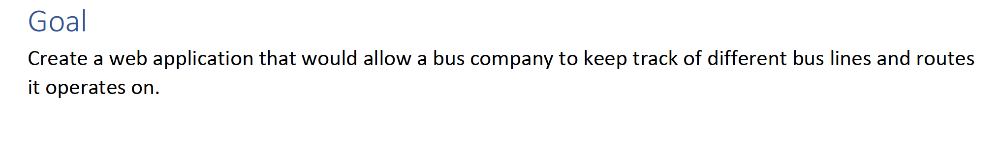
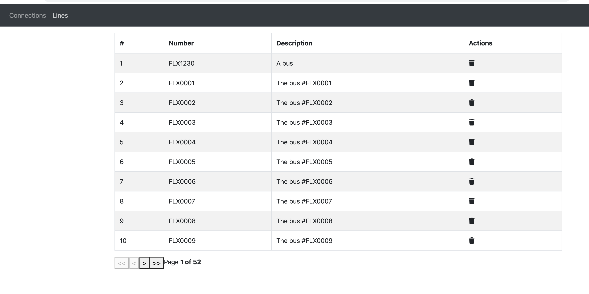
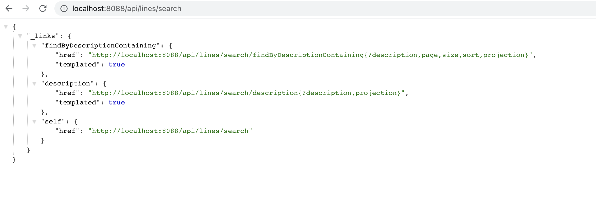

---
**Setup:**
- check that you have ports 3000 and 8088 available. If not, then please update files with some of your free ports in:
  - frontend/.env
  - docker-compose.yaml
  - backend/src/main/resources/application.properties
  - backend/Dockerfile
- run ```docker-compose up -d```
- open frontend: http://localhost:3000/ and backend: http://localhost:8088/api/

---
**Not implemented (due to the lack of free time):**
- FE: creating line, connection; BE: implemented
- FE: creating/editing line; BE: implemented
- FE: selectbox for lines in connections table
- FE: no js tests
- BE: only few junit tests
- FE: sources are not splitted properly into the components/etc and thereby it is hard to re-use and read the code
- FE: it would be nice to have js covered by TypeScript types/ets, however it would require even more time :)


---
**Assumptions were used:**
- tiny FE, rich BE;
- UI operates with a single BE API only;
- users, auth, permissions, session - are skipped as it is not described;
- app is faced to the end users as is, without any security;
- the expected amount of data could be handled by H2 DB;
- SQL/noSQL optimisations are only reasonable to do when/if knowing: current/max amount of data, schema and the most possible queries;
- default DB transactions are used as it is not described if multiple users could change some concurrent data at the same time;
- no DB caches (f.e. Hibernate L1,2,3) are included as expected amount of data is very low;


---
**Expected result:**




