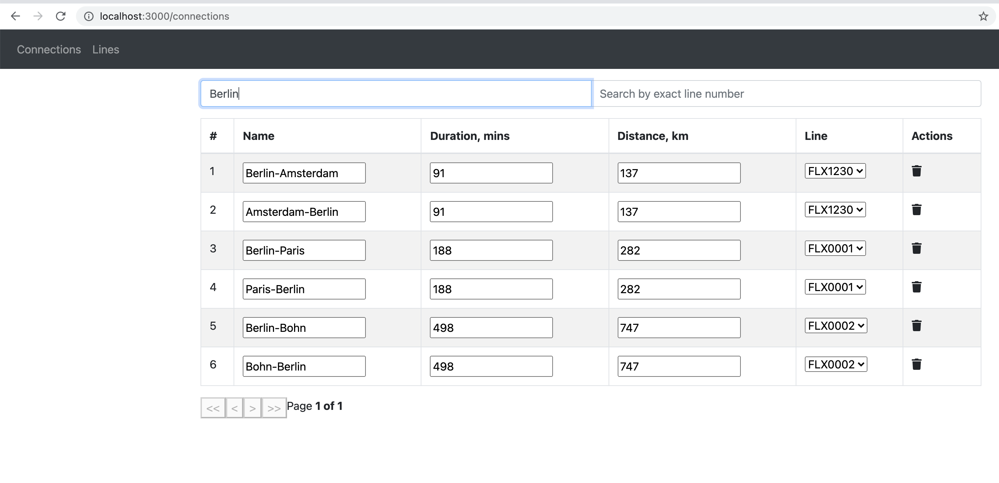

---
**Setup:**
- check that you have ports 3000 and 8088 available. If not, then pls update files
  - frontend/.env
  - docker-compose.yaml
  - backend/src/main/resources/application.properties
  - backend/Dockerfile
- run ```docker-compose up -d```
- open frontend: http://localhost:3000/ and backend: http://localhost:8088/api/

---
**Not implemented:**
- creating line, connection
- editing line
- selectbox for lines in connections table
- any js tests
- only few junit tests

---
**Expected result:**




